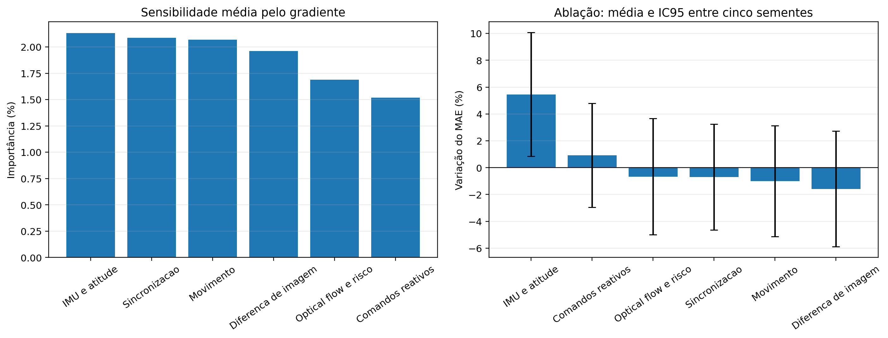
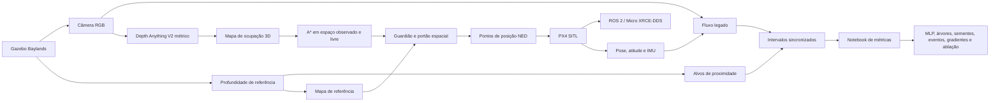

# Antes da Arquitetura

**Avaliação Experimental de Sinais Monoculares e Inerciais para Percepção de Proximidade em VANTs**

Este repositório contém o código e os documentos de um Trabalho de Conclusão de Curso sobre como avaliar informação visual e inercial antes de escolher uma arquitetura mais complexa para navegação autônoma. O estudo não propõe um novo controlador. Seu foco é verificar se os dados representam mudanças de proximidade de forma estável e se a profundidade monocular produz informação espacial útil para planejamento.

O projeto reúne dois eixos experimentais:

1. **Análise tabular dos sinais:** fluxo óptico, IMU, atitude, movimento, comandos e diferença de imagem são sincronizados por intervalo visual e avaliados com MLP, modelos de árvores, várias sementes, eventos, gradientes e ablação.
2. **Validação espacial da profundidade:** profundidade métrica é reprojetada em uma grade 3D de ocupação, usada por um planejador A* e submetida a portões de segurança antes de qualquer voo monocular.

> A profundidade monocular v19 passou pelo critério por pixel, mas não passou pelo portão espacial completo. Por isso, o voo monocular em SITL permaneceu bloqueado. Esse resultado negativo controlado é parte central do trabalho.

## Resultados finais

| Eixo | Evidência | Resultado |
|---|---|---|
| Sinais tabulares | 40 execuções e 1.234 intervalos válidos | Ganhos modestos com mais dados; resultados estáveis entre sementes; IMU e atitude foram o grupo mais consistente |
| Profundidade de referência + mapa + A* | Bateria fixa com 10 execuções | 10/10 missões completas, 30 objetivos, 147/156 planos e nenhum caminho inseguro adotado |
| Profundidade monocular v19 + mapa + A* | Avaliação por pixel e replay espacial | Critério por pixel aprovado; portão espacial reprovado; SITL monocular não autorizado |

A conclusão principal é que uma métrica de profundidade aceitável por pixel não garante um mapa seguro ou caminhos executáveis.




Os números e a proveniência da etapa espacial estão consolidados em [`docs/auditoria_final_espacial.md`](docs/auditoria_final_espacial.md).

## Arquitetura



No modo espacial, “sem controle reativo” não significa ausência de controle físico. O A* produz pontos de posição, enquanto o PX4 estabiliza o veículo e executa o controle de baixo nível.

### Componentes principais

| Caminho | Responsabilidade |
|---|---|
| [`main.py`](main.py) | Ponto de entrada dos nós ROS 2 e seleção do modo de navegação |
| [`drone_controller.py`](drone_controller.py) | Comunicação Offboard, coleta, fluxo legado e execução dos caminhos espaciais |
| [`monocular_depth_node.py`](monocular_depth_node.py) | Inferência ONNX e publicação da profundidade monocular métrica |
| [`spatial_mapping/`](spatial_mapping) | Geometria, grade de ocupação, fronteiras, A*, verificação e recuperação |
| [`estudos_e_analises/estudo_das_metricas.ipynb`](estudos_e_analises/estudo_das_metricas.ipynb) | Análise tabular, modelos, explicabilidade e figuras do estudo |
| [`scripts/run_spatial_battery.sh`](scripts/run_spatial_battery.sh) | Execução automatizada das baterias espaciais |
| [`scripts/build_spatial_final_report.py`](scripts/build_spatial_final_report.py) | Consolidação dos resultados e hashes dos artefatos |

## Modos de execução

| Modo | Profundidade usada pelo mapa | Decisão de alto nível | Estado final |
|---|---|---|---|
| `legacy_reactive` | Não usa mapa 3D para navegar | Lógica reativa baseada em fluxo óptico | Preservado para reprodução e trabalhos futuros |
| `ground_truth_debug` | Profundidade do Gazebo | A* e pontos de posição | Validado na bateria final |
| `monocular_topic` | Saída do estimador monocular | A* e pontos de posição | Bloqueado pelo portão espacial |

## Ambiente de referência

- Ubuntu 22.04.5 LTS em WSL 2;
- ROS 2 Humble;
- Gazebo Harmonic 8.10.0;
- PX4 no commit `e2708705a8ca625854f1129fd9dde2ae8ae16d59`;
- Python 3.10.12;
- veículo `x500_mono_cam` no mundo `baylands`.

Os pacotes Python usados na análise estão em [`requirements.txt`](requirements.txt). PX4, Gazebo, ROS 2, Micro XRCE-DDS Agent e o workspace ROS 2 precisam ser instalados separadamente.

```bash
cd ~/TCC_Drone
python3 -m pip install -r requirements.txt
source /opt/ros/humble/setup.bash
source ~/TCC_Drone/ws_ros2/install/setup.bash
```

## Execução da bateria espacial

A bateria automatizada usa dois terminais. Ajuste `PROJECT_DIR`, `PX4_DIR` e `ROS_OVERLAY` se o projeto não estiver nos caminhos usados no laboratório.

### Terminal 1: comunicação e imagens

```bash
source /opt/ros/humble/setup.bash

MicroXRCEAgent udp4 -p 8888 &

ros2 run ros_gz_bridge parameter_bridge \
  /world/baylands/model/x500_mono_cam_0/link/camera_link/sensor/camera/image@sensor_msgs/msg/Image[gz.msgs.Image &

ros2 run ros_gz_bridge parameter_bridge \
  /sim_depth_ground_truth@sensor_msgs/msg/Image[gz.msgs.Image &

wait
```

Mantenha esse terminal aberto. O executor reinicia PX4 e Gazebo entre as execuções, mas preserva o agente e as pontes.

### Terminal 2: validação e bateria de referência

```bash
cd ~/TCC_Drone
source /opt/ros/humble/setup.bash
source ~/TCC_Drone/ws_ros2/install/setup.bash

# Confere caminhos, configuração e processos sem iniciar a missão.
./scripts/run_spatial_battery.sh ground_truth_debug 1 --dry-run

# Executa a bateria com dez missões.
./scripts/run_spatial_battery.sh ground_truth_debug 10
```

O script abre PX4 e Gazebo, aplica os parâmetros necessários, executa `main.py` com `spatial_execute_path=true`, encerra a missão e prepara a próxima. As saídas ficam em:

- `logs/spatial_battery/AAAAmmdd_HHMMSS_ground_truth_debug/`;
- `datasets/spatial_mapping/run_AAAAMMDD_HHMMSS/`.

Antes de uma bateria real, confirme que os tópicos estão ativos:

```bash
ros2 topic hz /world/baylands/model/x500_mono_cam_0/link/camera_link/sensor/camera/image
ros2 topic hz /sim_depth_ground_truth
```

## Inspeção manual sem voo

Este modo constrói o mapa com a profundidade do Gazebo, mas mantém o armamento desabilitado:

```bash
cd ~/TCC_Drone
source /opt/ros/humble/setup.bash
source ~/TCC_Drone/ws_ros2/install/setup.bash

PYTHONNOUSERSITE=1 python3 main.py --ros-args \
  --params-file config/spatial_debug.yaml
```

Para analisar a execução salva:

```bash
python3 estudos_e_analises/analisar_mapeamento_espacial.py \
  ~/TCC_Drone/datasets/spatial_mapping/run_AAAAMMDD_HHMMSS
```

O analisador gera `spatial_summary.json` e `spatial_map_3d.html` dentro do diretório da execução.

## Pipeline monocular

O nó monocular exige um modelo ONNX métrico ou uma saída inversa calibrada de forma independente:

```bash
PYTHONNOUSERSITE=1 python3 monocular_depth_node.py --ros-args \
  --params-file config/monocular_depth_onnx.yaml \
  -p model_path:=/CAMINHO/ABSOLUTO/modelo_metrico.onnx
```

O mapa pode ser avaliado sem voo com:

```bash
PYTHONNOUSERSITE=1 python3 main.py --ros-args \
  --params-file config/spatial_monocular.yaml
```

A bateria automatizada verifica o arquivo ONNX, seu SHA-256 e os relatórios de qualificação:

```bash
MONOCULAR_MODEL_PATH=/CAMINHO/ABSOLUTO/modelo.onnx \
MONOCULAR_VALIDATION_REPORT=/CAMINHO/validacao.json \
MONOCULAR_MAPPING_REPORT=/CAMINHO/mapeamento.json \
  ./scripts/run_spatial_battery.sh monocular_topic 1 --dry-run
```

**O modelo v19 final não está autorizado para voo monocular.** A execução em SITL só deve ocorrer depois que os critérios por pixel e espaciais forem aprovados com relatórios ligados ao mesmo hash do modelo.

## Pipeline legado reativo

O fluxo usado nas coletas tabulares permanece disponível. Com PX4, Gazebo, agente e ponte RGB ativos:

```bash
cd ~/TCC_Drone
source /opt/ros/humble/setup.bash
source ~/TCC_Drone/ws_ros2/install/setup.bash

PYTHONNOUSERSITE=1 python3 main.py --ros-args \
  -p navigation_mode:=legacy_reactive \
  -p ground_truth_depth_topic:=/sim_depth_ground_truth \
  -p save_ground_truth_dataset:=true
```

Nesse modo, o fluxo óptico e a lógica de risco produzem comandos de velocidade. Ele está separado do modo `spatial_astar`, no qual os comandos reativos não alteram a navegação.


## Testes e relatórios

Execute a suíte espacial antes de alterar geometria, ocupação ou planejamento:

```bash
cd ~/TCC_Drone
python3 -m unittest discover -s tests -p "test_*.py" -v
```

No computador que contém os dados e modelos finais, gere novamente o pacote de evidências com:

```bash
python3 scripts/build_spatial_final_report.py
```

O relatório inclui o resumo da bateria de referência, a comparação v12-v19, a decisão dos portões e hashes dos artefatos.

## Dados e reprodutibilidade

Os dados brutos, mapas, pesos e logs não são publicados no GitHub devido ao volume. O repositório mantém código, configurações, notebook com saídas, manifestos e documentação de proveniência. Os caminhos `datasets/depth_ground_truth/old` e `datasets/spatial_mapping` descrevem a organização existente no computador do laboratório.

Documentação complementar:

- [execução detalhada do pipeline espacial](docs/execucao_pipeline_espacial.md);
- [metodologia da validação 3D](docs/validacao_espacial_3d.md);
- [auditoria final da etapa espacial](docs/auditoria_final_espacial.md);
- [reprodutibilidade das figuras](docs/reproducibilidade_figuras_tcc.md);
- [roteiro de apresentação da etapa espacial](docs/roteiro_apresentacao_espacial.md).

## Licença

Consulte o arquivo [`LICENSE`](LICENSE).
