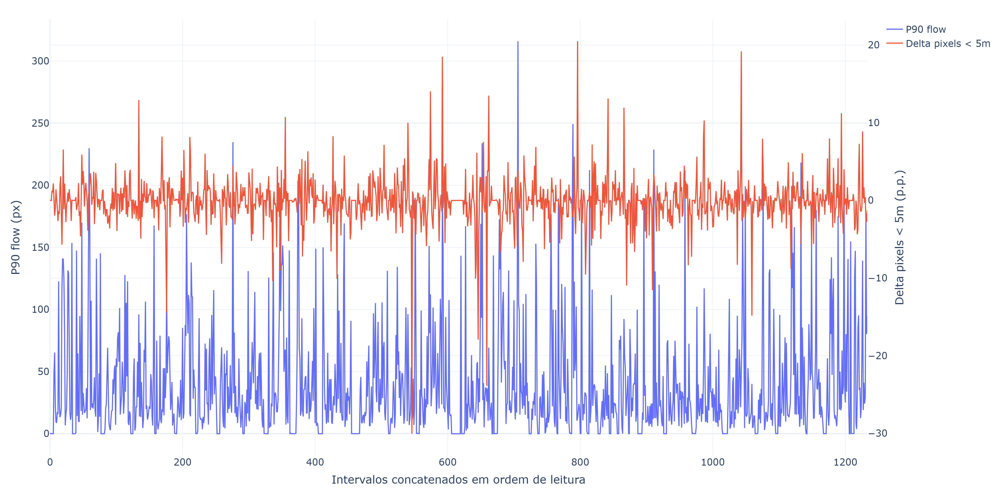
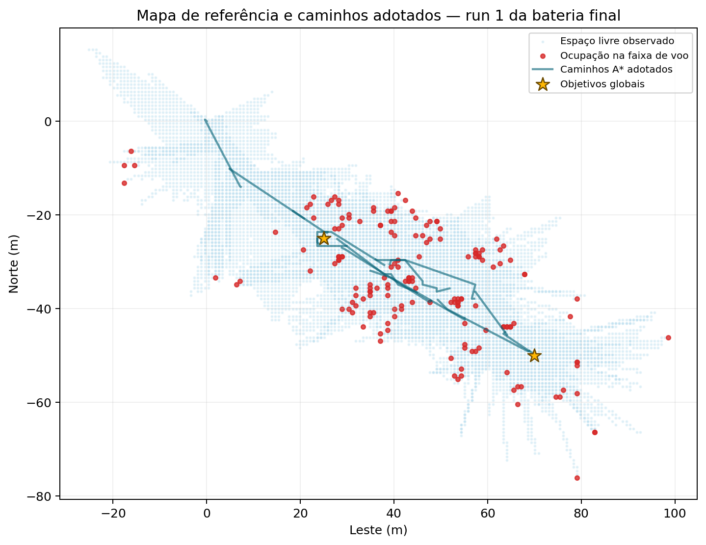

# TCC_Drone: Avaliação de Sinais Monoculares e Inerciais em VANTs

> A branch `main` reúne a versão atual do estudo, incluindo o pipeline legado reativo e a validação espacial com mapa 3D e A*.

## Pontos centrais do repositório

O projeto possui dois fluxos principais e uma validação espacial consolidada:

1. **Execução do pipeline de voo e coleta:** [`main.py`](main.py). Esse arquivo inicia os nós ROS 2 e coordena a coleta. O modo selecionado pode preservar a navegação reativa anterior ou usar mapa 3D e A*.
2. **Execução das métricas e dos experimentos:** [`estudos_e_analises/estudo_das_metricas.ipynb`](estudos_e_analises/estudo_das_metricas.ipynb). O notebook reúne o carregamento dos dados, as verificações de qualidade, o treinamento dos modelos, as comparações, a explicabilidade e a geração dos resultados apresentados no TCC.
3. **Validação espacial complementar:** [`spatial_mapping/`](spatial_mapping). O módulo reúne a reprojeção da profundidade, a grade 3D de ocupação e o planejamento A*. Seu papel é verificar se a informação de proximidade produz conhecimento espacial útil, sem desenvolver um novo controlador de voo.

Os diretórios `logs/` e `datasets/` que armazenam os dados brutos não estão disponíveis no GitHub devido ao volume dos arquivos. A análise tabular usa 40 execuções e 1.234 intervalos; separadamente, o acervo espacial local reúne 103 execuções completas produzidas em diferentes fases. Esses arquivos permanecem ignorados pelo Git e são necessários para refazer integralmente as análises a partir dos dados brutos. O notebook versionado mantém o código, as configurações e as saídas da análise final.

Este projeto é parte de um Trabalho de Conclusão de Curso (TCC) que defende a análise controlada dos dados antes da escolha de arquiteturas mais complexas para navegação monocular. O estudo investiga quais sinais representam variações de proximidade, quão estável é essa relação e onde os erros ficam concentrados.

O voo reativo fornece o ambiente de coleta, mas o trabalho não propõe nem compara controladores. A validação espacial acrescenta um mapa tridimensional e usa o A* como teste da utilidade da percepção. O resultado dessa etapa é um caminho formado por pontos de passagem; o PX4 continua responsável por executar esses pontos.

A simulação de alta fidelidade é alcançada através da integração do controlador de voo **PX4 (SITL)** com o motor físico **Gazebo Harmonic**, enquanto toda a inteligência e controle de alto nível rodam sobre o **ROS 2 (Humble)**, comunicando-se via middleware **Micro XRCE-DDS Agent**.

## Visão geral visual

A primeira etapa transforma duas atualizações consecutivas da câmera em um intervalo sincronizado. Fluxo óptico, movimento, IMU, atitude e comandos formam as entradas; a câmera de profundidade fornece apenas os alvos usados na avaliação.



Na etapa espacial, a profundidade é reprojetada em voxels livres e ocupados. O A* percorre somente o espaço conhecido como livre, e um guardião verifica cada caminho antes e durante a execução pelo PX4. A figura abaixo mostra uma projeção NED de uma execução da bateria final com profundidade de referência.



## Ideia do Projeto e Funcionalidades

O objetivo principal é organizar e avaliar sinais visuais e inerciais produzidos durante voos simulados. As principais características do projeto incluem:

*   **Execução Offboard:** O fluxo legado usa vetores de velocidade; a validação espacial envia somente pontos de passagem e deixa a dinâmica de voo a cargo do PX4.
*   **Coleta Visual e Inercial:** Uma câmera monocular, o fluxo óptico, a IMU, o movimento e os comandos do sistema são sincronizados por intervalo visual.
*   **Avaliação Experimental:** MLP, referências simples, modelos de árvores, várias sementes, eventos, gradientes e ablação ajudam a localizar os limites da representação.
*   **Validação Espacial:** A profundidade por pixel pode ser reprojetada em uma grade 3D e submetida ao A* para verificar se o mapa permite gerar um caminho livre de obstáculos.

---

## Arquitetura do Código

O código foi estruturado de forma modular, dividindo as responsabilidades de rede (ROS 2) e lógica de controle em dois arquivos distintos.

### 1. `main.py` (Ponto de Entrada / Orquestrador)
É o arquivo executável do projeto. Ele é responsável por:
*   Inicializar o ambiente do ROS 2.
*   Instanciar o nó do controlador de voo (`DroneOffboardNode`).
*   Manter o programa vivo e rodando o `rclpy.spin()`, garantindo que os callbacks de sensores e atuadores ocorram continuamente.

### 2. `drone_controller.py` (Execução e Coleta)
Este arquivo contém a comunicação com o PX4, a lógica de voo usada nas coletas e o processamento visual. Ele herda a classe Node do ROS 2 e é responsável por:
*   **Comunicação Bidirecional:** Publicar mensagens (`OffboardControlMode`, `TrajectorySetpoint`, `VehicleCommand`) e assinar sensores (VehicleLocalPosition, tópicos de imagem da câmera).
*   **Modos de navegação:** Preservar a execução reativa anterior e, no modo espacial, converter os caminhos do A* em setpoints de posição publicados a 25 Hz.
*   **Visão computacional:** Usar CvBridge e OpenCV para extrair os sinais do estudo e, na validação espacial, acumular a profundidade em um mapa 3D sem aplicar os antigos comandos reativos ao voo.

### 3. `estudos_e_analises/estudo_das_metricas.ipynb` (Análise dos Experimentos)

É o ponto central da análise feita após a coleta. O notebook:

* relaciona os diretórios correspondentes de `logs/` e `datasets/`;
* verifica sincronização, intervalos válidos, trajetórias e dados da IMU;
* treina a MLP e acompanha as curvas de perda;
* compara os marcos de crescimento do conjunto com validação e teste fixos;
* avalia várias sementes, modelos de árvores e ablação de grupos de entradas;
* executa a análise de eventos e a explicabilidade por gradientes;
* exporta os CSVs e gráficos usados no dashboard e na parte escrita.

### 4. `spatial_mapping/` (Validação Espacial)

O módulo, ainda desacoplado do ROS 2, contém:

* reprojeção do mapa de profundidade para pontos 3D;
* transformação dos pontos para um referencial comum;
* acumulação de espaço livre e ocupado em voxels;
* expansão dos obstáculos por uma margem de segurança;
* planejamento A* em três dimensões.

O encadeamento dessa etapa é: imagem RGB ou profundidade do Gazebo → profundidade métrica → reprojeção 3D → grade de ocupação → inflação dos obstáculos → A* → verificação do caminho → pontos de posição → controle de baixo nível pelo PX4. No modo monocular, um mapa paralelo produzido com a profundidade do Gazebo permanece restrito à avaliação e ao veto experimental de segurança.

O protocolo e as métricas planejadas estão em [`docs/validacao_espacial_3d.md`](docs/validacao_espacial_3d.md).
O roteiro de execução em etapas está em [`docs/execucao_pipeline_espacial.md`](docs/execucao_pipeline_espacial.md).

O fluxo possui dois modos explícitos:

* `ground_truth_debug`: usa a profundidade do Gazebo para validar geometria, mapa e A*. Não representa um resultado monocular.
* `monocular_topic`: recebe profundidade métrica pelo tópico `/monocular_depth` e mantém o Gazebo somente como referência de avaliação.

O adaptador [`monocular_depth_node.py`](monocular_depth_node.py) aceita um modelo ONNX externo. Os pesos não fazem parte do repositório: o ensaio monocular só pode começar depois que um modelo métrico, ou uma saída inversa calibrada de forma independente, for configurado e validado contra a referência do simulador.

Por segurança, `spatial_execute_path` fica desligado nos arquivos de configuração. O primeiro teste constrói o mapa sem armar o drone. A execução dos pontos do A* precisa ser habilitada explicitamente depois da inspeção dos eixos e da escala.

---

## Como Executar a Simulação

Para executar os experimentos espaciais, são necessários **2 terminais** em um ambiente Linux ou WSL. O primeiro mantém a comunicação ROS 2 ativa. O segundo executa a bateria automatizada, que abre PX4 e Gazebo, aplica os parâmetros necessários, inicia o código Python e reinicia a simulação entre as runs.

**Terminal 1: Micro XRCE-DDS Agent e pontes ROS 2/Gazebo**
```bash
source /opt/ros/humble/setup.bash

MicroXRCEAgent udp4 -p 8888 &

ros2 run ros_gz_bridge parameter_bridge /world/baylands/model/x500_mono_cam_0/link/camera_link/sensor/camera/image@sensor_msgs/msg/Image[gz.msgs.Image &

ros2 run ros_gz_bridge parameter_bridge /sim_depth_ground_truth@sensor_msgs/msg/Image[gz.msgs.Image &

wait
```

Mantenha esse terminal aberto durante toda a bateria. O script de limpeza preserva o `MicroXRCEAgent` e reinicia apenas PX4 e Gazebo.

**Terminal 2: bateria espacial automatizada**

Primeiro, valide a configuração sem abrir o simulador:

```bash
cd ~/TCC_Drone
source /opt/ros/humble/setup.bash
source ~/TCC_Drone/ws_ros2/install/setup.bash
./scripts/run_spatial_battery.sh ground_truth_debug 1 --dry-run
```

Depois, execute a bateria de referência. O exemplo abaixo realiza dez runs:

```bash
./scripts/run_spatial_battery.sh ground_truth_debug 10
```

O script inicia automaticamente PX4 e Gazebo no mundo `baylands`, aplica `EKF2_MAG_CHK_STR=0.25` e `NAV_DLL_ACT=0`, executa `main.py` com `spatial_execute_path=true`, encerra cada run e prepara a seguinte. Os logs da bateria ficam em `logs/spatial_battery/` e cada dataset espacial fica em `datasets/spatial_mapping/`.

O modo monocular usa o mesmo arranjo de dois terminais, mas exige um ONNX qualificado e relatórios compatíveis com o mesmo hash:

```bash
MONOCULAR_MODEL_PATH=/caminho/absoluto/modelo.onnx \
  ./scripts/run_spatial_battery.sh monocular_topic 1 --dry-run

MONOCULAR_MODEL_PATH=/caminho/absoluto/modelo.onnx \
  ./scripts/run_spatial_battery.sh monocular_topic 10
```

No estado final do estudo, a bateria monocular em SITL permanece bloqueada porque o modelo v19 não passou por todos os gates espaciais. O comando acima documenta o fluxo e só deve ser liberado quando os relatórios indicarem aprovação.

### Pipeline legado reativo

O fluxo anterior continua disponível por `navigation_mode:=legacy_reactive`. Depois de manter o Terminal 1 ativo, inicie PX4 e Gazebo e execute o nó ROS 2 com:

```bash
cd ~/TCC_Drone
source /opt/ros/humble/setup.bash
source ~/TCC_Drone/ws_ros2/install/setup.bash
PYTHONNOUSERSITE=1 python3 main.py --ros-args \
  -p navigation_mode:=legacy_reactive \
  -p ground_truth_depth_topic:=/sim_depth_ground_truth \
  -p save_ground_truth_dataset:=true
```

Nesse modo, o fluxo óptico e a lógica de risco geram comandos de velocidade. No modo `spatial_astar`, esses comandos não participam da navegação: o A* produz pontos de posição e o PX4 executa o controle de baixo nível. O roteiro detalhado de depuração, mapa parado e execução manual está em [`docs/execucao_pipeline_espacial.md`](docs/execucao_pipeline_espacial.md).

O dataset descarta automaticamente frames RGB com timestamp repetido, pares que reutilizam o mesmo frame de profundidade e intervalos temporais inválidos. Ao final de cada run, confira no `manifest.json` os campos `quality_counters`: `rgb_frames_rejected_nonmonotonic` deve ser baixo, e cada amostra salva deve ter `dt_s > 0` e `depth_dt_s > 0`.
